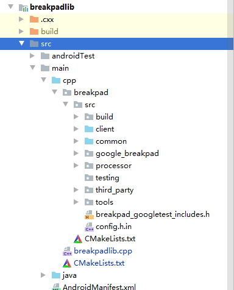
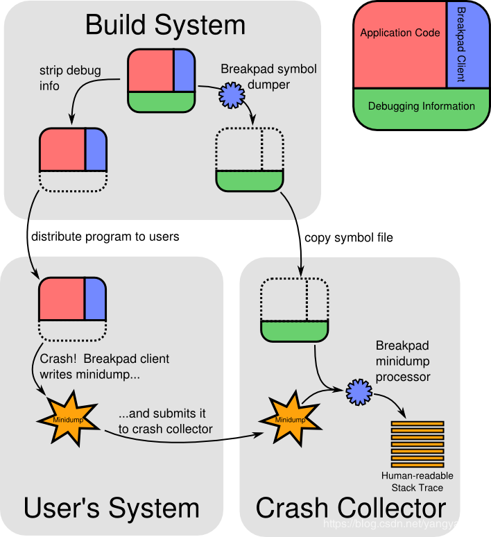
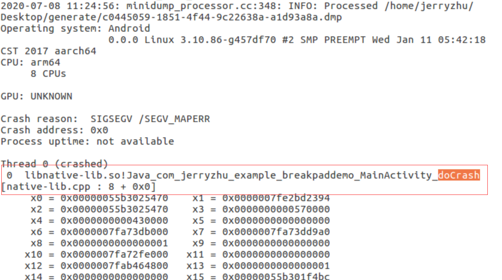
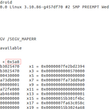
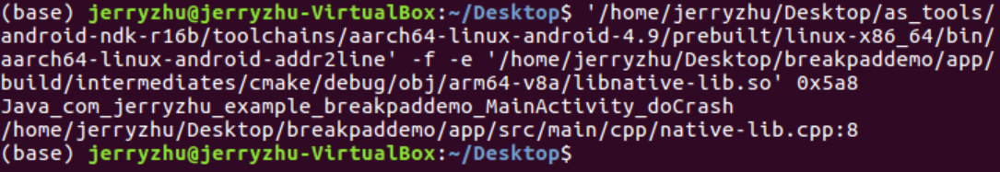
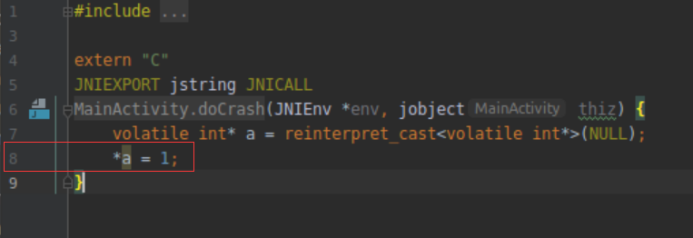

# breakpaddemo

### 简介:

此项目演示了如何把google开源项目breakpad集成进android应用,实现native即C++代码崩溃定位.项目中breakpadlib对breakpad进行了简单封装,开发者可以直接依赖此模块调用一行代码即可实现获取native崩溃信息的功能,详细步骤及用法见以下文档.

#### 获取和编译breakpad

[官方文档](https://github.com/google/breakpad/blob/master/README.md),
在windows,macOS,linux都可以编译,但复杂程度不一样,为了方便快速我是在linux上编译的.

1.获取depot-tools工具并配置环境

[步骤:](https://commondatastorage.googleapis.com/chrome-infra-docs/flat/depot_tools/docs/html/depot_tools_tutorial.html#_setting_up)

  * 获取depot-tools:

        git clone https://chromium.googlesource.com/chromium/tools/depot_tools.git

  * 配置环境变量:

        export PATH=/path/to/depot_tools:$PATH

2.创建用于放置breakpad源码的文件夹并进入,文件夹名必须为breakpad

    mkdir breakpad && cd breakpad

3.获取breakpad源码并进入源码目录
    
    fetch breakpad  
    cd src
   
4.编译源代码

    ./configure && make
    
   构建完成以后会生成处理so库和堆栈信息的工具,后续会用到这些工具：位于 

    src/processor/minidump_stackwalk, src/processor/minidump_dump
   
   当在linux中编译时还会生成以下工具

    src/tools/linux/dump_syms/dump_syms, src/tools/linux/md2core/minidump-2-core

#### 把breakpad集成进braeakpadlib

* 以android library的形式集成braeakpad代码,项目目录结构如下:

   

   官方提供的breakpad android示例工程sample_app是使用.mk文件编译的,此项目是使用CMakelists.txt编译的,[cmake文档](https://cmake.org/cmake/help/latest/manual/cmake.1.html).如图所示在main/cpp目录下新建breakpad目录,把源码中breakpad/src/src目录拷贝到新建的breakpad目录.

* 构建breakpad的CMkakeLists.txt文件配置 
    
```java

    cmake_minimum_required(VERSION 3.4.1)

    set(BREAKPAD_ROOT ${CMAKE_CURRENT_SOURCE_DIR})

    include_directories(${BREAKPAD_ROOT}/src ${BREAKPAD_ROOT}/src/common ${BREAKPAD_ROOT}/src/common/android/include)

    # List of client source files, directly taken from Makefile.am
    file(GLOB BREAKPAD_SOURCES_COMMON
        ${BREAKPAD_ROOT}/src/client/linux/crash_generation/crash_generation_client.cc
        ${BREAKPAD_ROOT}/src/client/linux/dump_writer_common/thread_info.cc
        ${BREAKPAD_ROOT}/src/client/linux/dump_writer_common/ucontext_reader.cc
        ${BREAKPAD_ROOT}/src/client/linux/handler/exception_handler.cc
        ${BREAKPAD_ROOT}/src/client/linux/handler/minidump_descriptor.cc
        ${BREAKPAD_ROOT}/src/client/linux/log/log.cc
        ${BREAKPAD_ROOT}/src/client/linux/microdump_writer/microdump_writer.cc
        ${BREAKPAD_ROOT}/src/client/linux/minidump_writer/linux_dumper.cc
        ${BREAKPAD_ROOT}/src/client/linux/minidump_writer/linux_ptrace_dumper.cc
        ${BREAKPAD_ROOT}/src/client/linux/minidump_writer/minidump_writer.cc
        ${BREAKPAD_ROOT}/src/client/minidump_file_writer.cc
        ${BREAKPAD_ROOT}/src/common/convert_UTF.c
        ${BREAKPAD_ROOT}/src/common/convert_UTF.cc
        ${BREAKPAD_ROOT}/src/common/md5.cc
        ${BREAKPAD_ROOT}/src/common/string_conversion.cc
        ${BREAKPAD_ROOT}/src/common/linux/elfutils.cc
        ${BREAKPAD_ROOT}/src/common/linux/file_id.cc
        ${BREAKPAD_ROOT}/src/common/linux/guid_creator.cc
        ${BREAKPAD_ROOT}/src/common/linux/linux_libc_support.cc
        ${BREAKPAD_ROOT}/src/common/linux/memory_mapped_file.cc
        ${BREAKPAD_ROOT}/src/common/linux/safe_readlink.cc
        )

    file(GLOB BREAKPAD_S_SOURCE ${BREAKPAD_ROOT}/src/common/linux/breakpad_getcontext.S)

    set_source_files_properties(${BREAKPAD_S_SOURCE} PROPERTIES LANGUAGE C)

    add_library(breakpad STATIC ${BREAKPAD_SOURCES_COMMON} ${BREAKPAD_S_SOURCE})

    target_link_libraries(breakpad log)

```

* 构建breakpadlib库的CMkakeLists.txt文件配置

```java

    cmake_minimum_required(VERSION 3.4.1)

    set(ENABLE_INPROCESS ON)
    set(ENABLE_OUTOFPROCESS ON)
    set(ENABLE_LIBCORKSCREW ON)
    set(ENABLE_LIBUNWIND ON)
    set(ENABLE_LIBUNWINDSTACK ON)
    set(ENABLE_CXXABI ON)
    set(ENABLE_STACKSCAN ON)
    if (${ENABLE_INPROCESS})
        add_definitions(-DENABLE_INPROCESS)
    endif ()
    if (${ENABLE_OUTOFPROCESS})
        add_definitions(-DENABLE_OUTOFPROCESS)
    endif ()
    
    set(CMAKE_C_FLAGS "${CMAKE_C_FLAGS} -Werror=implicit-function-declaration")
    set(CMAKE_CXX_FLAGS "${CMAKE_CXX_FLAGS} -std=c++11 ")
    
    include_directories(breakpad/src breakpad/src/common/android/include)
    add_subdirectory(breakpad)
    list(APPEND LINK_LIBRARIES breakpad)
    add_library(breakpad_core SHARED
           breakpadlib.cpp)
    target_link_libraries(breakpad_core
                      ${LINK_LIBRARIES}
                      log)
    
```

* build.gradle配置

```java

    defaultConfig {
        minSdkVersion 16
        targetSdkVersion 30
        versionCode 1
        versionName "1.0"

        ndk {
            abiFilters "armeabi-v7a", "arm64-v8a", "x86"
        }

        externalNativeBuild {
            cmake {
                cppFlags "-std=c++11"
                arguments "-DANDROID_TOOLCHAIN=gcc"
            }
        }
    }

    externalNativeBuild {
        cmake {
            path 'src/main/cpp/CMakeLists.txt'
        }
    }

```

* 核心代码,设置存储崩溃信息的文件夹和回调

```c++

    google_breakpad::MinidumpDescriptor descriptor(_path);
    static google_breakpad::ExceptionHandler eh(descriptor, NULL, DumpCallback, NULL, true, -1);

```


#### 把braeakpadlib集成进android项目

* 直接依赖即可
* 接口调用

```java

    if(mCrashDumpDir == null){ 
        //设置存放MINIDUMP_FILE文件的目录
        mCrashDumpDir = new File(getExternalCacheDir(), "breakpad/crash_dump");
    }

    if(!mCrashDumpDir.exists()){
        mCrashDumpDir.mkdirs();
    }

    //核心代码
    Breakpad.init(mCrashDumpDir.getAbsolutePath());

```

* 通过JNI调用C++触发native crash 会出现如下日志:

```java

    E/native_crash: crashDump path: /storage/emulated/0/Android/data/com.jerryzhu.example.breakpaddemo/cache/breakpad/crash_dump/a6e25f6a-08f2-4e31-9e5d5886-fd562ae0.dmp
``` 

 a6e25f6a-08f2-4e31-9e5d5886-fd562ae0.dmp就是breakpad生成的包含堆栈相关信息的文件,由于此文件是从无符号的so库中获取的,所以看不到什么具体信息,需要使用之前编译的工具结合有符号的so库来获取堆栈日志.

* 获取堆栈信息

     先来看一下整个流程:
     
    
    
    解释:
        我们都是给应用使用无符号的so库,无符号的so库体积小更安全.androidstudio在构建的时候还会在``$PROJECT_PATH/app/build/intermediates/cmake/debug/obj/$ABI/`` 下生成带有调试信息有符号的so库,breakpad提供了 ``dump_syms`` 工具可以从含有符号的so库中获取符号信息,当应用发成native crash时breakpad client会生成一份MINIDUMP_FILE即dmp格式的文件,breakpad提供了 ``minidump_stackwalk`` 工具结合这个dmp格式的文件和之前生成的符号表信息就可以定位原生代码崩溃位置了.

     具体步骤实施：   
 
    官方提供的步骤: 
[README.ANDROID](https://github.com/google/breakpad/blob/master/README.ANDROID)
       

    1.利用 ``dump_syms`` 工具Dump出有符号的so中的符号表

     ```sh

        dump_syms $PROJECT_PATH/obj/local/$ABI/libnative-lib.so > libnative-lib.so.sym
     ```
 
    2.创建包含上一步生成的符号表的目录

    
     ``libnative-lib.so.sym`` 文件的第一行是 ``MODULE Linux arm D51B4A5504974FA6ECC1869CAEE3603B0 test_google_breakpad`` 这种格式,创建的文件夹应该是这样的结构 ``$PROJECT_PATH/symbols/libnative-lib.so/$VERSION/`` 例如: ``$PROJECT_PATH/symbols/libnative-lib.so/D51B4A5504974FA6ECC1869CAEE3603B0/`` ,创建完成后把 ``libnative-lib.so.sym`` 拷贝到这个目录中去.
    

    3.使用 ``minidump_stackwalk`` 工具获取堆栈信息

     ```sh
    
        minidump_stackwalk $MINIDUMP_FILE $PROJECT_PATH/symbols
     ```

    ``MINIDUMP_FILE`` 是应用发生native crash时breakpad生成的文件,demo中是 ``
    e25f6a-08f2-4e31-9e5d5886-fd562ae0.dmp`` , ``PROJECT_PATH/symbols`` 是上一步中创建的含有符号表的文件目录

    此命令执行完之后,会看到如下输出:
    
    

    直接定位到了崩溃函数和代码行数

    4.另一种方法

       * 先使用minidump_stackwalk工具获取堆栈信息
           
           minidump_stackwalk $MINIDUMP_FILE > dumpCrash.txt
           
         文件内容如下所示由于没有使用函数符号表所以没有具体崩溃函数信息,但有崩溃地址:

   
    
        可以看到程序崩溃地址和native堆栈信息

     * 再使用addr2line工具利用含有符号信息的so和崩溃地址来定位代码崩溃位置
      
        ```
       $NDK_PATH/toolchains/aarch64-linux-android-4.9/prebuilt/linux-x86_64/bin/aarch64-linux-android-addr2line -f -e $PROJECT_PATH/obj/local/$ABI/libnative-lib.so $crash_address
        ```

        64位使用 ``aarch64-linux-android-addr2line`` ,32位是 
     ``$NDK_PATH/toolchains/arm-linux-androideabi-4.9/prebuilt/linux-x86_64/bin/arm-linux-androideabi-addr2line`` ,so库为androidstudio生成的含有符号信息的so库, ``crash_address`` 是上面获取到的崩溃地址如0x5a8,命令执行结果如下:
    
     
   
     同样可以看到发生崩溃的函数和代码行数

     

     准确定位.
        

   
